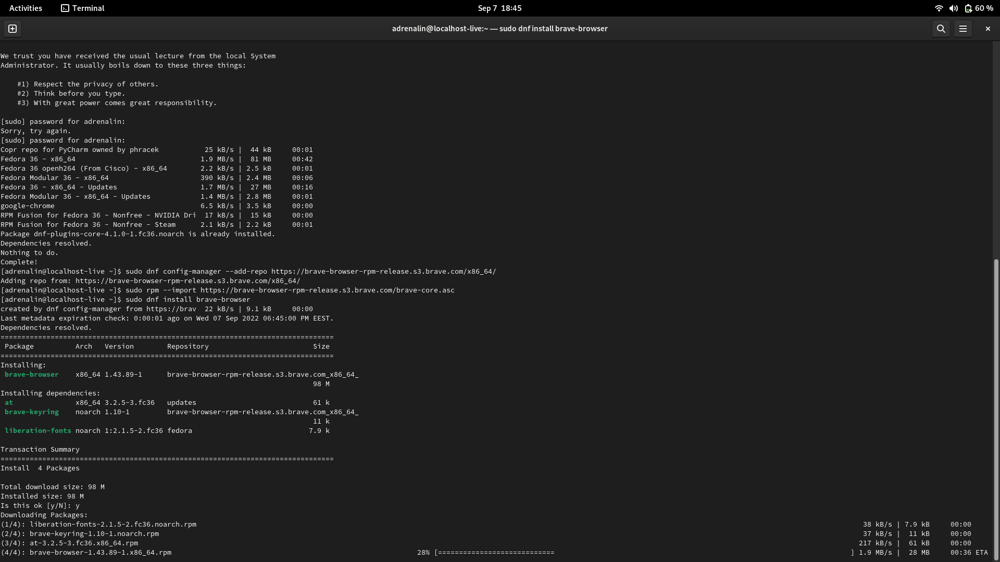
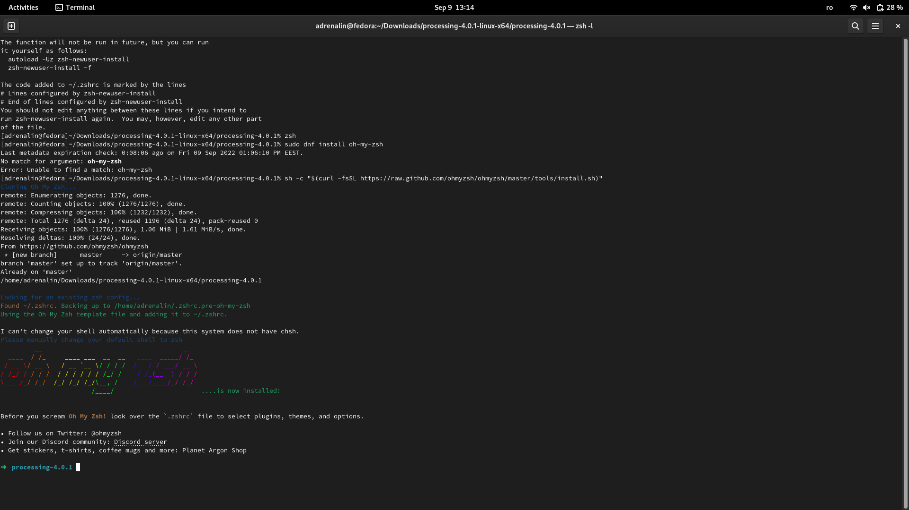
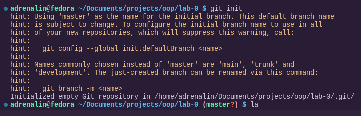
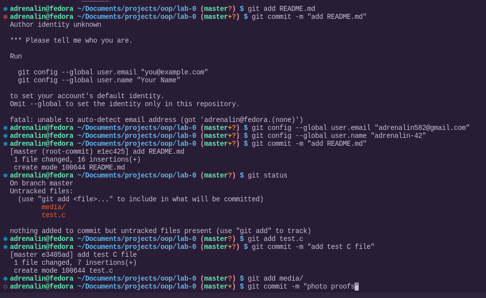
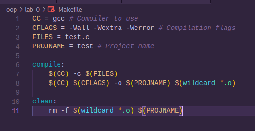

# Lab 0 at OOP

## Step 1 - Install a UNIX-based operating system

I have installed Fedora OS. Forgot to make screenshots during the installation phase. 

## Step 2 - Install essential tools

Installed zsh, oh-my-zsh, 

## Step 3 - Create a Git repository

And here is the Makefile that compiles the project.

