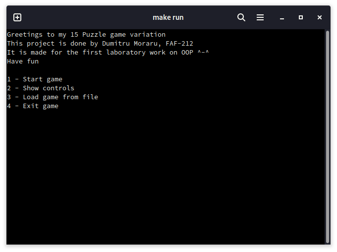

# Lab 1 at OOP

## Puzzle 15

This a terminal style game of famous Puzzle 15.

## What is done:

- Menu
- Input handling
- Visual way to observe game progress
- Clear design
- Canvas resizing
- Constraints to not get out of bounds
- Random puzzle generator
- Player position color highlight

## TO DO

- Colorful output
- Implement file saving and loading from file
- Restart feature
- Do/undo feature
- Algorithm that will solve the game
- Settings option in the Menu
- Better input

## Known bugs

- The input can get stuck sometimes, due to `getchar()`, will try fixing it

## Building

~~~~
make
~~~~

## Launching

~~~~
make run
~~~~

