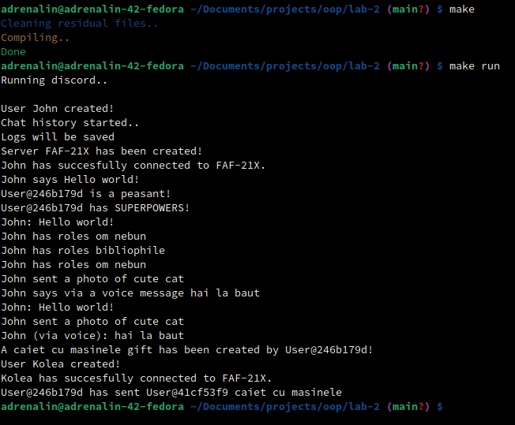

# Lab 2 at OOP

## Into OOP and Encapsulation

A simple showcase of the functionality.

## Discord chat simulator:

- Server class
- User class
- Message class
- Settings class
- ChatHistory class
- Administrator class
- Roles class
- Voice messages class
- Photo class
- Gifts class

## Building

~~~~
make
~~~~

## Launching

~~~~
make run
~~~~

