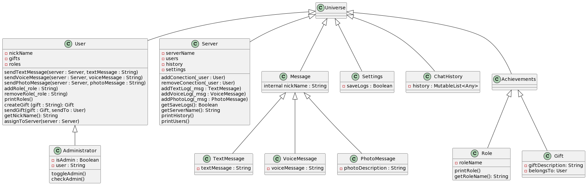
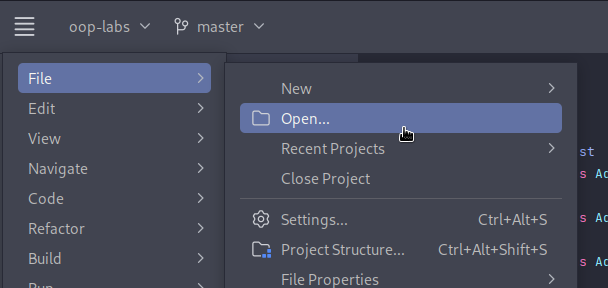
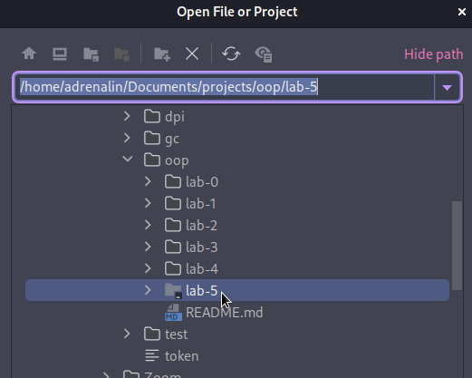

# Lab 6 at OOP

## Architecture and SOLID

A diagram visualization of the project.

## What it includes?

Universe superclass:

- Server class
- User class
   1. Administrator subclass
- Message class
   1. Text messages subclass
   2. Voice messages subclass
   3. Photo messages subclass
- Settings class
- Chat History class
- Achievements class
   1. Roles subclass
   2. Gifts subclass

## Why is this simulation unique?

Every message users send have an impact on their:

- Happiness
- Violence
- IQ

### This also affects everyone connected to the server.

## Watch out.. 
``If a user is violent and is not happy, he will start to rage out on
everyone connected to the server.``

## Launching

1. Open ``JetBrains-Idea-CE``
2. Follow the insructions below:
3. Select the project as in instructions:
   
4. Click ``Run`` and enjoy.
